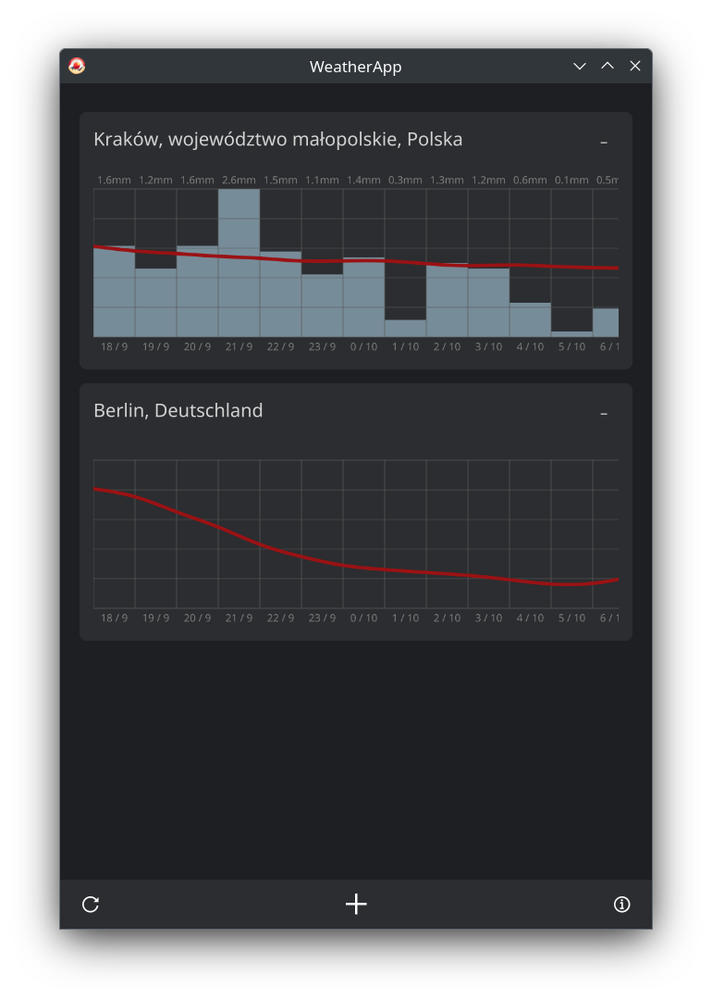

# WeatherApp

A simple weather app written in Scala.

*This project is my experiments with the Scala 3 programming language.
Developed within the subject of Scala Programming Language at the AGH University of Science and Technology.*

## Stack

1. Scala 3.2.2
2. Gradle Kotlin DSL
3. JavaFX

The project also uses:

1. [`lihaoyi:requests`](https://mvnrepository.com/artifact/com.lihaoyi/requests) -
   for HTTP requests
2. [`lihaoyi:upickle`](https://mvnrepository.com/artifact/com.lihaoyi/upickle) -
   for serialization/deserialization & JSON

## Hints

* Forecast chart is scrollable
* Additional information (humidity, apparent temp, etc.) will be shown on mouse hover

## IDE support

As of June 2023, Scala 3 support in IntelliJ is **very** poor 
([Scala plugin](https://plugins.jetbrains.com/plugin/1347-scala) version 2023.1.18).
There are many false positive error detection cases, which makes the whole 
experience quite bad (read: IntelliJ with Scala plugin is unusable).

A much better Scala 3 support is in **VSCode + Metals** (version 1.23.0), hovewer,
it is less intelligent.

## Thanks

* Scala community
* JavaFx community
* [Lee Haoyi](https://github.com/lihaoyi) for easy to use Scala libraries
* JetBrains for [icons](https://github.com/JetBrains/icons)
* [Hotpot](https://hotpot.ai/art-generator) for AI generated icon
* [Img.Upscaler](https://imgupscaler.com/) for AI upscaled icon
* [OpenMeteo](https://open-meteo.com/) for free & easy to use weather API
* [OpenStreetMap](https://www.openstreetmap.org) for free reverse geocoding API
* VSCode developers
* Metals developers
* And everyone else thanks to whom this project was created

## Screenshots

